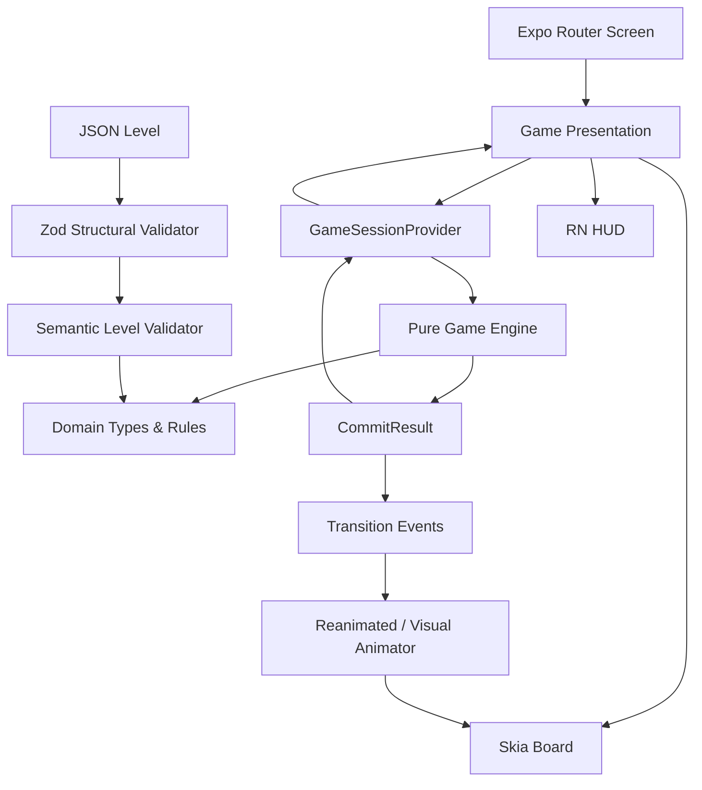

# Phase 3 — System Architecture

**Project:** Car Party Hobby  
**Phase:** 3 — System Architecture  
**Status:** Draft complete — Gate 3 review pending  
**Primary Role:** System Architect

---

## 1. Architecture objective

Implement the approved deterministic puzzle domain without allowing React Native, rendering, animation, or navigation concerns to become gameplay truth.

The central architectural rule is:

> **Pure engine decides. Application coordinates. Presentation visualizes.**

ภาษาไทย:

> **Game Engine เป็นผู้ตัดสินกติกา, Application layer ควบคุม flow, Presentation มีหน้าที่แสดงผลเท่านั้น**

---

## 2. Selected architecture

Car Party Hobby uses a layered client-side architecture:

```text
┌──────────────────────────────────────────────┐
│ Expo Router / Screens                       │
│ Home / Game / Error                         │
├──────────────────────────────────────────────┤
│ Presentation                                │
│ RN Views HUD + Skia Board + Animations      │
├──────────────────────────────────────────────┤
│ Application                                 │
│ GameSessionProvider / Commands / Input Lock │
├──────────────────────────────────────────────┤
│ Pure TypeScript Game Engine                 │
│ preview / validate / commit / normalize     │
├──────────────────────────────────────────────┤
│ Domain                                      │
│ types / invariants / level semantics        │
├──────────────────────────────────────────────┤
│ Level Data + Validation                     │
│ JSON -> schema validation -> semantic check │
└──────────────────────────────────────────────┘
```

Dependency direction is downward only.

The Domain and Engine layers must not import React, React Native, Expo, Skia, Reanimated, navigation, or storage libraries.

---

## 3. Rendering architecture

### Decision: Hybrid rendering

Use:

- **React Native Skia** for the interactive puzzle board
- **React Native Views/Text/Pressable** for HUD, screen chrome, dialogs, buttons, accessibility-facing controls, and non-board content
- **Reanimated** as the primary animation/timing bridge for board transitions where needed

### Why hybrid

The board is spatial, graph-like, and animation-heavy, while HUD/content remains conventional mobile UI.

Skia is appropriate for:

- lanes and path geometry,
- vehicle sprites/shapes,
- Reactive Junction visualization,
- route previews,
- occupancy/blocker indicators,
- board-scale transformations.

React Native Views are appropriate for:

- header/HUD,
- restart controls,
- move state feedback,
- win/deadlock overlays,
- home/settings screens,
- accessible text and standard buttons.

This keeps the board performant without forcing the entire app into a canvas.

---

## 4. Engine architecture

### Pure deterministic engine

The engine exposes pure operations conceptually equivalent to:

```text
createInitialState(level)
deriveMovePreview(level, state, vehicleId)
validateMove(level, state, vehicleId)
deriveLegalMoves(level, state)
commitMove(level, state, vehicleId)
deriveOutcome(level, state)
restart(level)
```

### Commit result

`commitMove` returns a value similar to:

```text
CommitResult {
  nextState
  transitionEvents[]
}
```

`transitionEvents` describe what happened for presentation/animation purposes.

Examples:

- VEHICLE_MOVED
- JUNCTION_TOGGLED
- PASSENGER_BOARDED
- VEHICLE_DEPARTED
- OUTCOME_CHANGED

Events are descriptive output. They are not commands and cannot alter GameState.

---

## 5. Authoritative state ownership

### GameState

The authoritative gameplay state is owned by the application session adapter.

The MVP uses a React `useReducer` + Context boundary called conceptually:

`GameSessionProvider`

It owns:

- authoritative `GameState`,
- selected vehicle ID,
- transient visual transition state,
- input-lock state,
- level-load state.

### Why no external state library in MVP

The vertical slice has:

- one active puzzle session,
- one primary gameplay screen,
- no server synchronization,
- no multiplayer,
- no cross-screen shared business state.

A reducer provides explicit transitions with minimal dependency surface.

If future phases create a real need for an external store, the application adapter can be replaced without changing the pure engine API.

### Important separation

```text
Authoritative:
GameState

Transient interaction:
selectedVehicleId

Derived:
MovePreview
legalMoves
board occupancy indexes

Presentation-only:
animation progress
camera scale/pan
highlight opacity
particle effects
```

---

## 6. Animation architecture

Animation must never be allowed to mutate domain state.

### Commit flow

```text
Player confirms move
        │
        ▼
Pure engine commitMove()
        │
        ├── nextState
        └── transitionEvents
        │
        ▼
Application commits nextState immediately
        │
        ├── lock player input
        └── start visual transition
        │
        ▼
Skia/Reanimated visualize transitionEvents
        │
        ▼
Animation completes
        │
        ├── clear visual transition
        └── unlock input if outcome = IN_PROGRESS
```

During animation, authoritative gameplay already represents the normalized committed result.

The presentation may keep immutable visual snapshots needed to interpolate old → new positions, but those snapshots are not authoritative gameplay state.

### Why commit before animation

- animation timing cannot alter logic,
- frame drops cannot change results,
- interrupted animation cannot partially commit a move,
- deterministic tests do not depend on rendering.

---

## 7. Navigation architecture

Use **Expo Router**.

Minimal MVP route structure:

```text
src/app/
├── _layout.tsx
├── index.tsx        # Home / start
└── game.tsx         # Active puzzle
```

Non-route modules must live outside `src/app`.

The MVP does not require tabs.

---

## 8. Level loading architecture

### Concrete format

Store authored levels as versioned JSON-compatible data.

Example location:

```text
src/levels/data/
└── level-001.json
```

### Validation pipeline

```text
Raw JSON
   │
   ▼
Structural schema validation (Zod)
   │
   ▼
LevelDefinition candidate
   │
   ▼
Semantic/domain validation
   │
   ├── reference integrity
   ├── unique IDs
   ├── junction constraints
   ├── occupancy integrity
   ├── unique-or-none routing constraints
   └── capacity constraints
   │
   ▼
Validated LevelDefinition
```

### Zod boundary

Zod is used at the input boundary only.

The core Domain/Engine does not depend on Zod.

TypeScript domain interfaces remain explicit inside the domain module.

---

## 9. Persistence architecture

### MVP decision: no persistence required

The first vertical slice requires:

- start,
- play,
- restart,
- win/deadlock.

It does not require saving an in-progress game or progression across application restarts.

Therefore no persistence dependency is introduced for the first vertical slice.

Future progression/settings may use a small local persistence adapter without changing the engine.

---

## 10. Failure handling

### Invalid level definition

Classification: development/content defect.

Behavior:

- level validation fails before session creation,
- game engine is not started,
- development builds expose actionable validation diagnostics,
- user-facing builds show a controlled "Level unavailable" fallback.

### Ambiguous route

Classification: domain/content defect.

Because MVP requires unique-or-none route resolution, more than one valid route causes validation/engine failure rather than arbitrary path selection.

### Broken invariant

Classification: programming defect.

Development/test behavior: fail fast with diagnostic context.

Production behavior: stop the current session safely and display a recoverable error surface rather than continuing with corrupted state.

### UI/render failure

Must not mutate or repair GameState implicitly.

---

## 11. Architecture diagram



---

## 12. Source-of-truth hierarchy

1. Approved requirements and domain documents
2. Pure Domain + Engine runtime state
3. Application session state
4. Derived presentation models
5. Rendered UI

A lower layer may not redefine rules owned by a higher-authority domain layer.
