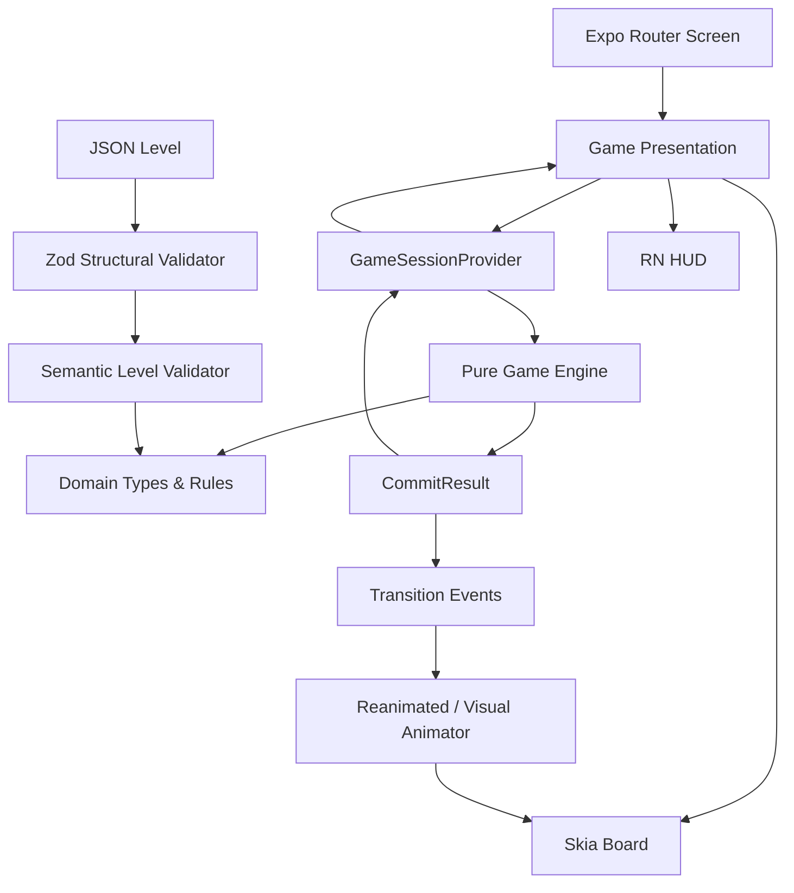
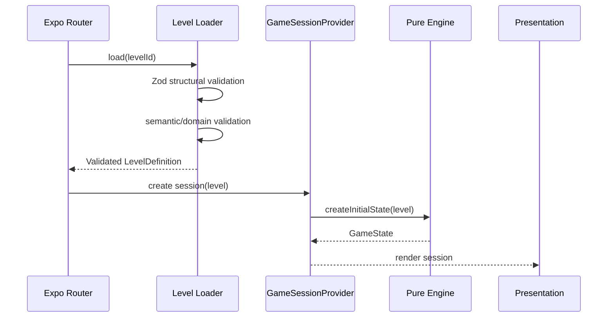
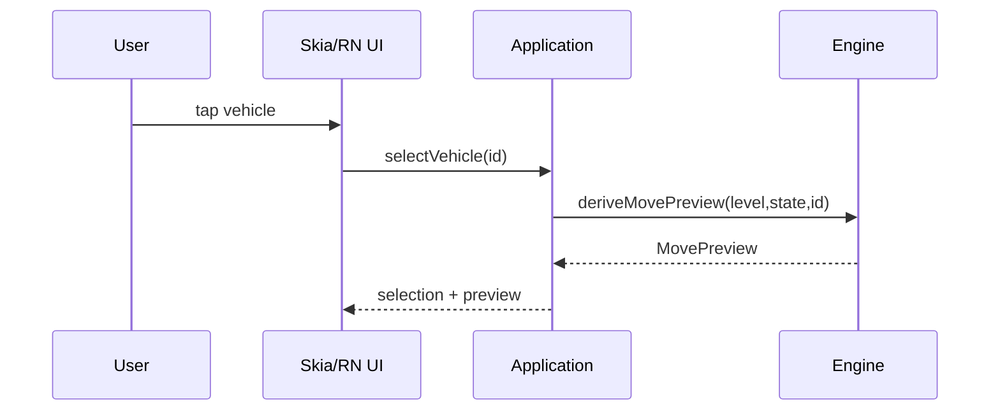
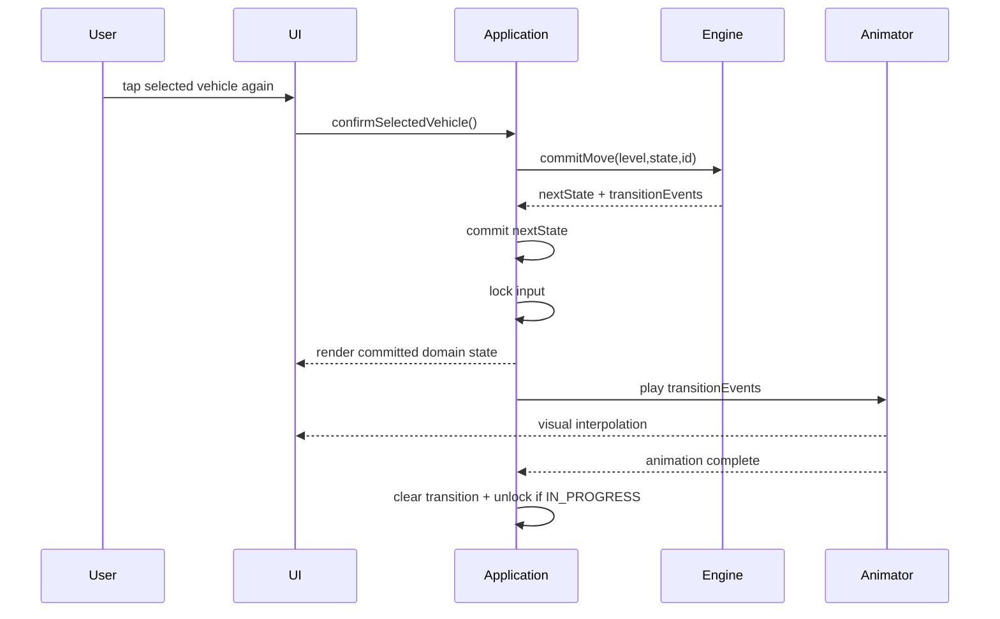
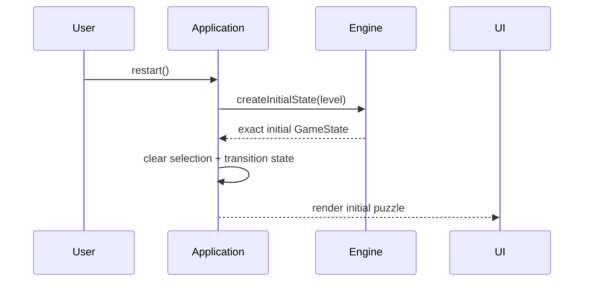

# Gate 3 Independent Review Bundle

Project: Car Party Hobby
Phase: 3 — System Architecture
Purpose: Self-contained architecture review packet.

## Review Instructions

Review the Phase 3 architecture against approved Phase 1 requirements and Phase 2 domain constraints.

Return exactly:

FINAL GATE 3 RECOMMENDATION:
PASS / PASS WITH MINOR FIXES / BLOCK

CRITICAL FINDINGS
- ...

MAJOR FINDINGS
- ...

MINOR FINDINGS
- ...

For every finding include:
- affected file
- affected ADR/module/section
- problem
- why it matters
- exact recommended change

Then answer:
"Is this architecture safe to hand off to Phase 4 UX/UI and Phase 5 Implementation Planning?"
Yes / No, with a short reason.

Focus especially on:
1. Pure-engine boundary leaks
2. Authoritative-state ownership
3. Commit-before-animation correctness
4. Skia/RN/Reanimated responsibility separation
5. useReducer/Context suitability for MVP
6. Level JSON/Zod/domain validation boundary
7. Dependency-direction violations
8. Testing architecture gaps
9. Expo Go vs development-build assumptions
10. Any architecture decision that can violate Gate 2 invariants

Do not redesign gameplay.

---

# APPROVED REQUIREMENTS

## docs/01-requirements/requirements.md

# Phase 1 — Requirements

**Project:** Car Party Hobby  
**Status:** ✅ Gate 1 Approved  
**Primary Role:** Business/System Analyst  
**Specific Primary Agent:** ChatGPT: Work  
**Supporting / Review:** ChatGPT: Chat + Gemini: Chat  
**Human Gate:** Gate 1 — Product Owner

---

## 1. Objective / เป้าหมาย

Translate the approved Discovery decisions into explicit gameplay requirements, functional rules, non-functional requirements, and acceptance criteria for the first playable vertical slice.

แปลง decision ที่ผ่าน Gate 0 แล้วให้เป็น gameplay requirements, functional rules, non-functional requirements และ acceptance criteria ที่ชัดเจนสำหรับ playable vertical slice แรก

## 2. Approved inputs from Gate 0

- Target: casual players of all ages
- Session length: 2–5 minutes
- Platform: Android only
- App stack constraint: React Native + TypeScript
- Prototype: Expo Go acceptable
- Movement model: lane/path-based
- Signature mechanic: Reactive Lanes
- Information model: full-information deterministic puzzle
- MVP: offline/local-first
- Vertical slice: one playable level
- No backend/login/ads/IAP/leaderboard/multiplayer in V1

---

## 3. Functional requirements

### FR-001 — Board inspection

The player must be able to inspect the complete current puzzle state required for a meaningful decision before committing a move.

ผู้เล่นต้องสามารถมองเห็นสถานะ puzzle ปัจจุบันที่จำเป็นต่อการตัดสินใจก่อน commit move

### FR-002 — Vehicle selection

The player must be able to tap/select a vehicle that remains active on the board.

ผู้เล่นต้องสามารถแตะ/เลือก vehicle ที่ยัง active อยู่บนกระดานได้

### FR-003 — Route preview

Selecting a vehicle must show its intended current path from its current position to its next destination/staging point.

เมื่อเลือก vehicle ระบบต้องแสดง path ปัจจุบันจากตำแหน่งรถไปยัง destination/staging point ถัดไป

### FR-004 — Blocking feedback

If the vehicle cannot move, the game must indicate the first blocking point or blocking reason.

หากรถเคลื่อนไม่ได้ ระบบต้องแสดงจุดแรกหรือเหตุผลแรกที่ทำให้ถูก block

### FR-005 — Move commit interaction

The MVP uses a two-step tap interaction:

1. First tap selects a vehicle and shows its preview.
2. Tapping the same selected vehicle again commits the move if valid.
3. Tapping another vehicle changes selection and preview.
4. An invalid move must not mutate gameplay state.

MVP ใช้ interaction แบบสองขั้น: แตะครั้งแรกเพื่อเลือกและ preview และแตะรถคันเดิมอีกครั้งเพื่อ commit move หาก valid

### FR-006 — Lane/path validation

Before a move can be committed, the game must validate the complete required path against:

- current vehicle occupancy,
- static blockers,
- current Reactive Junction state,
- destination/staging availability.

ก่อน commit ระบบต้องตรวจ path ทั้งเส้นที่จำเป็นกับ occupancy, blocker, junction state และ destination availability

### FR-007 — Reactive Junction state

At least one junction in the vertical slice must have exactly two deterministic states.

Reactive Junction ใน vertical slice อย่างน้อย 1 จุดต้องมี 2 state ที่ deterministic

### FR-008 — Junction change preview

Before committing a move, the player must be able to see whether that move will trigger a Reactive Junction and what its next state will be.

### FR-009 — Junction trigger resolution

A committed route that traverses a configured Reactive Junction must toggle that junction exactly once after the vehicle completes its movement.

รถที่ traverse Reactive Junction ตาม route ที่ commit แล้วจะ trigger junction หนึ่งครั้งหลัง movement เสร็จ

### FR-010 — Waiting/parking capacity

The level must include a finite number of staging/waiting slots. A board vehicle that requires staging may move only if it can legally reach an available slot.

### FR-011 — Passenger queue and matching

Passengers are represented as a fully visible ordered queue.

A vehicle may automatically board passengers only from the **front of the queue**, and only while the front passenger color/type matches that vehicle.

Passenger เป็น queue ที่มองเห็นลำดับทั้งหมด และรับขึ้นรถจากหัวคิวเท่านั้นเมื่อสี/ประเภทตรงกับรถ

### FR-012 — Vehicle capacity

For the first vertical slice, all passenger-carrying vehicles use a **fixed capacity defined by the level**.

The capacity value is visible when relevant. Per-vehicle variable capacities are deferred beyond the first vertical slice.

Vertical slice แรกใช้ capacity แบบค่าคงที่ระดับ level เพื่อลด complexity ส่วน capacity ต่างกันรายคันเลื่อนไปหลัง MVP

### FR-013 — Automatic boarding resolution

After every successful vehicle arrival and after every queue change, the game must automatically resolve all immediately available deterministic boarding events before accepting the next player move.

### FR-014 — Waiting vehicle departure

A waiting vehicle departs and frees its slot when it reaches its required capacity.

If it has not reached capacity, it remains in its slot and may automatically board additional matching passengers later when they reach the front of the queue.

### FR-015 — Win detection

The game must detect the win state when:

1. all required passengers have boarded and departed, **and**
2. all required active vehicles for the level have cleared the board/waiting area.

### FR-016 — Lose/deadlock detection

After automatic resolution is exhausted, the game must detect deadlock when:

1. the level is not already won, **and**
2. there is no legal player move that would mutate gameplay state.

A legal move is one that can complete its required path and legally resolve its destination/staging requirement under the current state.

### FR-017 — Restart

The player must be able to restart the level to its exact initial deterministic state, including:

- vehicle positions,
- passenger queue,
- waiting slots,
- Reactive Junction states,
- completion state.

### FR-018 — Local-only runtime

The MVP must function without account login, cloud services, or network/backend dependencies.

---

## 4. Approved gameplay rules

### GR-01 — Path occupancy

**Decision: occupied-footprint blocking + full-path validation.**

Idle vehicles block only the lane/path footprint they currently occupy.

Before a selected vehicle commits, the game validates its complete required route. Because MVP movement is sequential and atomic, there is no persistent "reserved next segment" state between player turns.

รถที่ยังไม่เคลื่อน block เฉพาะพื้นที่ที่ครอบครองจริง ระบบตรวจเส้นทางทั้งหมดก่อน commit และไม่มีการ reserve segment ข้าม turn

**Reasoning:** keeps the state deterministic without introducing traffic-simulation concurrency.

---

### GR-02 — Intersection priority

**Decision: no simultaneous right-of-way system in MVP.**

Only the currently selected vehicle is evaluated for movement. An intersection is traversable when:

- the selected route permits it,
- its current Reactive Junction state permits it,
- no blocking vehicle/static obstacle occupies the required path.

There is no traffic-light timing, speed comparison, or simultaneous vehicle priority in the first vertical slice.

**Reasoning:** the puzzle is about sequence selection, not real-time traffic arbitration.

---

### GR-03 — Move atomicity

**Decision: moves are atomic.**

A committed vehicle moves from its current location to its resolved next destination/staging point as one gameplay transaction.

A vehicle cannot be intentionally stopped mid-path by the player.

Animation may visually show travel through path segments, but the underlying rule resolves one atomic move.

**Reasoning:** visual animation must not create intermediate gameplay states that change the puzzle rules.

---

### GR-04 — Reactive Junction trigger

**Decision: traversal trigger.**

A Reactive Junction triggers when the committed route **traverses** that junction.

For the MVP:

- one route traversal causes at most one toggle of that junction,
- merely selecting/previewing a route does not trigger it,
- an invalid/blocked move does not trigger it,
- a vehicle's final destination or staging/waiting slot **cannot be located on a Reactive Junction**; vehicles may only traverse Reactive Junctions.

สำหรับ MVP จุดหมายปลายทางหรือ waiting/staging slot ต้องไม่อยู่บน Reactive Junction รถสามารถวิ่งผ่าน Reactive Junction ได้เท่านั้น

---

### GR-05 — Junction timing

**Decision: toggle after vehicle movement completes.**

The junction state used to calculate the current vehicle's route remains fixed for that move.

After the vehicle reaches its destination/staging point, each triggered Reactive Junction toggles before the next player decision.

**Reasoning:** the current vehicle cannot reroute itself halfway through the move; Reactive Lanes affect future moves.

---

### GR-06 — Passenger boarding order

**Decision: visible front-of-queue automatic boarding.**

Passengers form an ordered queue visible to the player.

For each boarding resolution:

1. inspect the front passenger,
2. if a vehicle **currently occupying a waiting slot** of the matching color/type is eligible, board that passenger,
3. repeat while the next front passenger can board deterministically,
4. stop when the front passenger has no eligible vehicle.

If multiple waiting vehicles are equally eligible for the same front passenger, the vehicle occupying the **earliest waiting-slot index** receives boarding priority.

**Reasoning:** this provides a deterministic tie-breaker and makes queue order strategically meaningful.

---

### GR-07 — Waiting slot behavior

**Decision: first-available slot + stay-until-full.**

- A vehicle that reaches staging occupies the lowest-index available waiting slot.
- Boarding resolves immediately after arrival.
- A vehicle remains in that slot until its fixed capacity is reached.
- When full, it departs automatically and frees the slot.
- For the MVP, **departure means the vehicle is immediately removed/despawned from the active gameplay state without requiring an exit route**; the waiting slot becomes free immediately.
- Slot ordering remains stable; remaining vehicles do not need to compact/reorder in the MVP.

สำหรับ MVP คำว่า departure หมายถึงรถถูกนำออกจาก active gameplay state ทันทีโดยไม่ต้องคำนวณเส้นทางออก และ waiting slot ว่างทันที

**Reasoning:** slot state is visible, stable, and easy to predict.

---

### GR-08 — Deadlock definition

**Decision: no legal state-changing move after automatic resolution.**

The game first resolves all automatic boarding/departure events.

Then:

```
deadlock =
  !win &&
  legalPlayerMoves.length === 0
```

A legal player move must:

- have a valid complete path,
- satisfy current junction/path constraints,
- have a valid destination or available waiting slot,
- cause an actual state transition.

This definition intentionally avoids solver-based look-ahead in the MVP.

**Example deadlock:** all required staging slots are occupied, the front passenger matches none of the waiting vehicles, and every remaining board vehicle is blocked or has no legal destination.

---

### GR-09 — Win condition

**Decision: passengers served + required vehicles cleared.**

The level is won only when:

1. there are no unserved required passengers remaining,
2. no required vehicle remains active on the board,
3. no required vehicle remains in a waiting slot.

This prevents a "win" while unresolved vehicles still occupy the gameplay state.

---

## 5. Canonical turn-resolution order

Every committed move follows this exact logical sequence:

1. **Select** vehicle.
2. **Preview** route, blocker status, destination, and predicted Reactive Junction changes.
3. **Validate** the complete move.
4. **Commit** the move.
5. **Move** vehicle atomically to its destination/staging point.
6. **Toggle** any Reactive Junction traversed by the committed route.
7. **Assign waiting slot** if required.
8. **Resolve automatic passenger boarding** from the visible queue.
9. **Depart full vehicles** and free their slots.
10. Repeat automatic boarding/departure until no further automatic event is possible.
11. **Evaluate win**.
12. If not won, generate legal player moves.
13. If zero legal moves remain, **evaluate deadlock/lose**.
14. Otherwise return control to the player.

ภาษาไทยโดยสรุป:

**Preview → Validate → Commit → Move → Toggle Junction → Waiting Slot → Boarding → Departure → Win/Deadlock → Next Turn**

This order is normative for Phase 2 domain modeling and later automated tests.

---

## 6. Non-functional requirements

### NFR-001 — Responsiveness

Selection feedback and route preview should appear without perceptible delay on typical Android phones targeted by the project.

### NFR-002 — Determinism

The same initial level state and same committed move sequence must produce the same gameplay result.

### NFR-003 — Explainability

A player must be able to understand why a move is valid or blocked using visible feedback.

### NFR-004 — Short-session design

The first level should be completable within the intended 2–5 minute session window after the player understands the controls.

### NFR-005 — Offline operation

The vertical slice must remain fully playable with no network connection.

### NFR-006 — Testability

Core rules must be representable independently of rendering so later phases can execute automated state-transition tests.

### NFR-007 — No hidden RNG

The vertical slice must not use hidden random values that alter route validity, passenger order, junction behavior, win state, or deadlock state.

### NFR-008 — State integrity

A visual animation must not independently mutate authoritative gameplay state outside the approved turn-resolution rules.

---

## 7. Vertical-slice acceptance criteria

The Phase 1 specification must support one level satisfying all of the following:

1. The player can inspect all information required to make a deterministic decision.
2. At least two vehicles create a meaningful ordering decision.
3. Selecting a vehicle previews its complete current route.
4. A blocked vehicle clearly identifies its first blocker/reason.
5. A valid move uses the two-step select → commit interaction.
6. At least one move is constrained by path occupancy.
7. At least one Reactive Junction has two visible states.
8. At least one successful move traverses and toggles that junction.
9. The junction's predicted next state is visible before commit.
10. The toggled junction changes the legal route or move availability of a later vehicle.
11. Waiting capacity is finite and affects at least one decision.
12. Passengers are shown as a visible ordered queue.
13. Boarding occurs only from the front of that queue using deterministic color/type matching.
14. At least one vehicle must wait because it cannot yet become full.
15. A full waiting vehicle departs automatically and frees its slot.
16. The level has a reproducible win state.
17. The level has a reproducible deadlock/lose state.
18. Restart restores the exact initial state.
19. Replaying the same move sequence produces the same result.
20. The complete experience works offline.
21. No hidden RNG is required.
22. A typical successful playthrough can fit the intended 2–5 minute session target.
23. If multiple waiting vehicles match the front passenger, the vehicle in the **lowest-index waiting slot** deterministically receives the passenger.

---

## 8. Gate 1 decision register

| Decision | Status | Approved rule |
|---|---|---|
| Path occupancy rule | ✅ Closed | Idle vehicles block occupied footprint; full path validated before atomic move |
| Intersection priority | ✅ Closed | No simultaneous priority; selected vehicle evaluated against current state |
| Move atomicity | ✅ Closed | Atomic source → destination/staging move |
| Reactive Junction trigger | ✅ Closed | Toggle on successful traversal |
| Junction timing | ✅ Closed | Toggle after movement completes, before next player decision |
| Boarding order | ✅ Closed | Visible queue; front-only deterministic matching; earliest waiting slot wins ties |
| Waiting slot behavior | ✅ Closed | Lowest-index free slot; vehicle stays until full; full vehicle departs |
| Deadlock definition | ✅ Closed | Not won + no legal player move after automatic resolution |
| Win condition | ✅ Closed | All required passengers served + all required vehicles cleared |

---

## 9. Explicitly deferred beyond Phase 1

The following are intentionally **not** required to pass Gate 1:

- exact numeric board dimensions,
- exact number of passenger colors,
- exact fixed vehicle capacity value,
- data/schema representation of lanes and junctions,
- rendering library,
- animation library,
- state-management library,
- audio behavior,
- art direction,
- advanced Reactive Junction variants,
- variable vehicle capacities,
- chained/timed/random junctions,
- level progression/meta-game.

These belong to Phase 2–4 or later.

---

## 10. Gate 1 exit criteria

| Criterion | Status |
|---|---|
| Functional requirements complete enough for domain modeling | ✅ Pass |
| Core gameplay rules closed or explicitly deferred | ✅ Pass |
| Win state unambiguous | ✅ Pass |
| Deadlock state unambiguous | ✅ Pass |
| Reactive Lanes behavior deterministic | ✅ Pass |
| Turn-resolution order defined | ✅ Pass |
| Vertical-slice acceptance criteria testable | ✅ Pass |
| Architecture/library choices avoided | ✅ Pass |

## 11. Independent review / ผลการ Review

**Reviewer:** Gemini: Chat  
**Result:** ✅ **PASS WITH MINOR FIXES**  
**Reported by:** Product Owner

### Review findings and resolution

| Finding | Severity | Resolution |
|---|---|---|
| Vehicle could ambiguously stop on a Reactive Junction | Major | ✅ GR-04 now forbids destinations/staging slots on Reactive Junctions |
| "Departure" behavior was undefined | Major | ✅ GR-07 now defines departure as immediate despawn/removal with no exit-route calculation |
| Boarding eligibility could include non-slot vehicles | Minor | ✅ GR-06 now restricts boarding to vehicles currently occupying waiting slots |
| Boarding tie-breaker lacked explicit acceptance coverage | Minor | ✅ AC-23 added for lowest-index waiting-slot priority |

All reviewer findings have been incorporated. No Critical findings remain, and the requirements are now accepted for handoff to Phase 2 — Domain & Data.

ข้อเสนอแนะจาก Independent Review ถูกแก้ครบทั้ง 4 จุดแล้ว ไม่มี Critical finding คงค้าง และ requirement พร้อมส่งต่อไป Phase 2 — Domain & Data

---

**Gate 1 status:** ✅ **APPROVED — REVIEW FINDINGS RESOLVED**

**Next after approval:** Phase 2 — Domain & Data.


---

# APPROVED DOMAIN CONSTRAINTS

## docs/02-domain-data/domain-model.md

# Phase 2 — Domain Model

**Project:** Car Party Hobby  
**Phase:** 2 — Domain & Data  
**Status:** Draft complete — Gate 2 review pending

---

## 1. Modeling principles / หลักการออกแบบ Domain

The domain model is technology-agnostic. It describes gameplay meaning and state relationships without assuming React Native components, a state-management library, or a rendering engine.

Domain model นี้ไม่ผูกกับ UI/rendering library และแยกข้อมูลออกเป็นสองกลุ่มหลัก:

1. **LevelDefinition — immutable/static definition**  
   ข้อมูลที่นิยามด่านและไม่เปลี่ยนระหว่างการเล่นรอบหนึ่ง

2. **GameState — mutable authoritative runtime state**  
   สถานะจริงของเกมที่เปลี่ยนจาก move และ automatic resolution

Derived UI state such as selection and route preview is not authoritative gameplay state.

---

## 2. Aggregate root

### GameSession

A game session combines:

- one immutable `LevelDefinition`,
- one mutable `GameState`,
- transient `InteractionState`,
- derived `MovePreview`.

```text
GameSession
├── LevelDefinition (immutable)
├── GameState      (authoritative mutable state)
├── InteractionState (transient)
└── MovePreview    (derived)
```

**Rule:** Only approved domain transitions may mutate `GameState`.

---

## 3. Core entities

### 3.1 LevelDefinition

Represents one deterministic puzzle definition.

Fields:

- `levelId` — stable unique level identifier
- `schemaVersion`
- `vehicleCapacity` — fixed capacity for all passenger vehicles in the MVP
- `pathNetwork`
- `reactiveJunctions`
- `waitingSlots`
- `staticBlockers`
- `vehicles`
- `passengers`
- `initialJunctionStates`

The level definition is immutable during one game session.

### 3.2 VehicleDefinition

Static identity and starting configuration for a vehicle.

Fields:

- `vehicleId`
- `matchKey` — passenger matching value such as a color/type key
- `startNodeId`
- `initialOccupancyKeys[]`
- `targetStagingEntryNodeId`
- `requiredForWin` — true for all MVP vehicles unless explicitly stated otherwise

A vehicle definition does not store its changing runtime location.

### 3.3 PassengerDefinition

Represents one passenger token in the ordered queue.

Fields:

- `passengerId`
- `matchKey`

Passenger identity is stable even after boarding/departure.

### 3.4 PathNetwork

Logical directed network used for route resolution.

Contains:

- `nodes[]`
- `segments[]`

A path is derived from enabled directed segments under the current Reactive Junction states.

### 3.5 PathNode

Fields:

- `nodeId`
- `kind`

Allowed MVP kinds:

- `ENTRY`
- `WAYPOINT`
- `JUNCTION`
- `STAGING_ENTRY`

A `JUNCTION` node may be associated with exactly one `ReactiveJunctionDefinition`.

A final destination/staging entry must not be a `JUNCTION`.

### 3.6 PathSegment

Directed connection between two nodes.

Fields:

- `segmentId`
- `fromNodeId`
- `toNodeId`
- `occupancyKeys[]`

`occupancyKeys` are logical collision-space identifiers. They are domain-level occupancy units, not pixels.

A route is blocked when its required occupancy keys intersect another active board vehicle's occupied keys or a static blocker's keys.

### 3.7 ReactiveJunctionDefinition

Static definition of a two-state Reactive Junction.

Fields:

- `junctionId`
- `nodeId`
- `stateIds[2]`
- `enabledOutgoingSegmentsByState`

Example meaning:

```text
state A -> north-to-east enabled
state B -> north-to-west enabled
```

The runtime state is stored separately in `GameState.junctionStates`.

### 3.8 WaitingSlotDefinition

Fields:

- `slotId`
- `index`

Rules:

- index is unique within a level,
- lower index has higher deterministic boarding/assignment priority,
- waiting slots are outside Reactive Junction nodes,
- slot order never changes during a session.

### 3.9 StaticBlockerDefinition

Fields:

- `blockerId`
- `occupancyKeys[]`

Static blockers never move or change state in the MVP.

---

## 4. Runtime entities

### 4.1 VehicleState

Each vehicle has exactly one runtime location category:

```text
BOARD
WAITING_SLOT
DEPARTED
```

Conceptual union:

```text
VehicleState =
  | BoardVehicleState
  | WaitingVehicleState
  | DepartedVehicleState
```

#### BoardVehicleState

- `status = BOARD`
- `vehicleId`
- `nodeId`
- `occupiedKeys[]`
- `boardedPassengerIds[]`

For the first vertical slice, a board vehicle normally has zero boarded passengers.

#### WaitingVehicleState

- `status = WAITING_SLOT`
- `vehicleId`
- `slotId`
- `boardedPassengerIds[]`

#### DepartedVehicleState

- `status = DEPARTED`
- `vehicleId`
- `servedPassengerIds[]`

Departure is terminal for the MVP.

### 4.2 Passenger runtime partition

Passenger state is represented through three mutually exclusive locations:

- `remainingPassengerQueue[]` — ordered passenger IDs still waiting
- passenger IDs inside a waiting vehicle's `boardedPassengerIds[]`
- `servedPassengerIds[]` — passengers whose full vehicle departed

Every passenger must exist in exactly one of these partitions.

### 4.3 JunctionState

Fields:

- `junctionId`
- `stateId`

The state ID must belong to the corresponding two-state junction definition.

### 4.4 GameOutcome

Allowed values:

- `IN_PROGRESS`
- `WON`
- `DEADLOCKED`

`WON` and `DEADLOCKED` are terminal outcomes for the current attempt.

---

## 5. Interaction and derived value objects

### 5.1 InteractionState

Transient, non-authoritative UI interaction state.

Fields:

- `selectedVehicleId | null`

Changing selection does not mutate `GameState`.

### 5.2 MovePreview

Derived from:

- `LevelDefinition`
- current `GameState`
- selected `vehicleId`

Fields:

- `vehicleId`
- `routeSegmentIds[]`
- `routeOccupancyKeys[]`
- `assignedWaitingSlotId | null`
- `traversedJunctionIds[]`
- `junctionTransitions[]`
- `validation`

A preview is disposable and may be recomputed at any time.

### 5.3 MoveValidationResult

Conceptual shape:

```text
MoveValidationResult
├── valid: boolean
├── reasonCode
├── firstBlocker
└── destinationSlotId
```

Suggested reason codes:

- `NONE`
- `VEHICLE_NOT_ACTIVE`
- `NO_ROUTE`
- `PATH_OCCUPIED`
- `STATIC_BLOCKER`
- `NO_WAITING_SLOT`
- `AMBIGUOUS_ROUTE`

The domain must expose enough information for FR-004 blocking feedback.

---

## 6. Relationships / ความสัมพันธ์

```text
LevelDefinition
├── owns PathNetwork
│   ├── PathNodes
│   └── PathSegments
├── owns ReactiveJunctionDefinitions
│   └── references JUNCTION PathNode
├── owns WaitingSlotDefinitions
├── owns StaticBlockerDefinitions
├── owns VehicleDefinitions
│   ├── references start PathNode
│   └── references STAGING_ENTRY PathNode
└── owns PassengerDefinitions

GameState
├── vehicleStates[vehicleId]
├── remainingPassengerQueue[passengerId]
├── servedPassengerIds[passengerId]
├── junctionStates[junctionId]
└── outcome
```

No runtime entity owns a duplicate authoritative copy of a static definition.

---

## 7. Identity boundaries

All IDs are stable and unique within a `LevelDefinition`.

Required ID namespaces:

- LevelId
- VehicleId
- PassengerId
- NodeId
- SegmentId
- JunctionId
- WaitingSlotId
- BlockerId

Implementation may use strings, branded types, or another representation later; Phase 2 only requires stable identity semantics.

---

## 8. Derived indexes

The following values should be treated as derived, not independent mutable truth:

- waiting-slot occupancy — derived from `VehicleState.status === WAITING_SLOT`
- board occupancy — derived from active board vehicle occupied keys
- passenger location lookup — derived from queue/onboard/served partitions
- legal moves — derived from current GameState + LevelDefinition
- win/deadlock eligibility — derived after automatic resolution
- current route — derived from current path graph + junction states

This reduces duplicated state and prevents inconsistency.

---

## 9. MVP route determinism rule

For any active vehicle under a given valid GameState, route resolution to its staging entry must produce:

- exactly one valid route, or
- no valid route.

More than one simultaneously valid route is an invalid/ambiguous level state for the MVP.

Reactive Junction states are therefore allowed to change **which unique route exists**, but not to create player route-choice branching in the first vertical slice.

ภาษาไทย: ใน MVP ผู้เล่นเลือก “รถคันไหน” ไม่ได้เลือก “เส้นทางไหน” ระบบต้อง resolve route ได้เพียงเส้นเดียวหรือไม่มีเส้นทางเท่านั้น

---

## 10. Phase 2 decision summary

- Graph-based logical path model
- Logical occupancy keys instead of pixel collision
- Vehicle location modeled as an exclusive union: BOARD / WAITING_SLOT / DEPARTED
- Waiting-slot occupancy derived from vehicle state
- Passenger state modeled as an exclusive queue/onboard/served partition
- Reactive Junction runtime state separated from junction definition
- Selection/preview kept outside authoritative GameState
- Route resolution must be unique-or-none in the MVP


## docs/02-domain-data/domain-invariants.md

# Phase 2 — Domain Invariants

These invariants are normative constraints for Phase 3 architecture and later implementation/tests.

---

## INV-01 — Deterministic state transition

Given the same:

- LevelDefinition,
- normalized GameState,
- committed VehicleId,

the resulting normalized next GameState must be identical.

No hidden RNG may participate.

## INV-02 — Exclusive vehicle location

Every vehicle is in exactly one status:

- BOARD
- WAITING_SLOT
- DEPARTED

Never more than one.

## INV-03 — Exclusive passenger location

Every passenger exists in exactly one runtime partition:

- remaining queue,
- onboard exactly one waiting vehicle,
- served.

## INV-04 — Queue stability

Passenger queue order can change only by removing the current front passenger.

No insertion, shuffling, or middle removal exists in the MVP.

## INV-05 — Waiting-slot uniqueness

At most one WAITING_SLOT vehicle may reference a given slot ID.

## INV-06 — Stable waiting-slot priority

Waiting-slot indices are unique and immutable for the session.

Lower index always has higher assignment and boarding tie-break priority.

## INV-07 — Junction state validity

Every runtime Reactive Junction state must be one of the exactly two state IDs defined by that junction.

## INV-08 — No stopping on Reactive Junction

No vehicle board destination, staging-entry destination, or waiting slot may resolve onto a Reactive Junction node.

Reactive Junctions are traversal-only.

## INV-09 — Departure is terminal

A DEPARTED vehicle can never become active again during the same attempt.

Restart creates a new initial attempt instead of reversing departure.

## INV-10 — Departure has no exit-path side effect

MVP departure is immediate removal from active gameplay state.

It cannot block a lane, traverse a junction, or trigger another junction.

## INV-11 — Board occupancy integrity

Two active BOARD vehicles may not occupy the same logical occupancy key in a normalized state.

Static blocker occupancy may not overlap a valid active vehicle footprint.

## INV-12 — Full-path commit validity

A vehicle may transition BOARD → WAITING_SLOT only if its complete resolved route is valid at commit time.

## INV-13 — Unique route

For a movable active vehicle, route resolution produces at most one route to its staging entry under the current junction state.

Multiple simultaneously valid routes are invalid for the MVP.

## INV-14 — Junction timing

The committed vehicle's route is evaluated entirely with pre-move junction states.

Junction toggles apply only after the vehicle's atomic movement completes.

## INV-15 — Junction toggle cardinality

A committed move toggles each Reactive Junction it traverses at most once.

## INV-16 — Boarding eligibility

Only a vehicle currently occupying a waiting slot may board passengers.

## INV-17 — Boarding tie-breaker

If multiple waiting vehicles are eligible for the front passenger, the vehicle with the lowest slot index receives that passenger.

## INV-18 — Capacity bound

For every non-departed vehicle:

```text
0 <= onboardPassengerCount <= level.vehicleCapacity
```

A vehicle reaching capacity must be automatically departed before the state becomes player-interactive again.

## INV-19 — Normalized player-input state

Player input is accepted only when no immediate boarding/departure event remains unresolved.

## INV-20 — Outcome exclusivity

Exactly one outcome is active:

- IN_PROGRESS
- WON
- DEADLOCKED

WON and DEADLOCKED are terminal for that attempt.

## INV-21 — Win precedence

After auto-resolution, win is evaluated before deadlock.

A winning state must never also be labeled DEADLOCKED.

## INV-22 — Deadlock definition

A normalized non-winning state is DEADLOCKED iff no legal state-changing player move exists.

## INV-23 — Restart reproducibility

Restarting the same LevelDefinition always reconstructs the same logical initial GameState.

## INV-24 — Preview purity

Generating selection, route preview, blocker feedback, or predicted junction transitions must not mutate GameState.

## INV-25 — Static/runtime separation

LevelDefinition never stores mutable values such as current waiting occupancy, current passenger queue progress, current vehicle state, or current outcome.

---

## Invariant-to-requirement traceability

| Invariant group | Requirements covered |
|---|---|
| Determinism / purity | NFR-002, NFR-007, NFR-008 |
| Vehicle lifecycle | FR-009, FR-010, FR-014, FR-015 |
| Passenger lifecycle | FR-011, FR-013, FR-014 |
| Reactive Junctions | FR-007, FR-008, FR-009, GR-04, GR-05 |
| Waiting slots | FR-010, GR-06, GR-07, AC-23 |
| Outcome | FR-015, FR-016, GR-08, GR-09 |
| Restart | FR-017 |
| Preview | FR-003, FR-004, FR-005 |

ภาษาไทย: Invariant เหล่านี้คือกฎที่ implementation และ test ใน Phase หลัง ๆ ต้องรักษาไว้ หาก code ทำให้ invariant ใดแตก ต้องถือว่าเป็น domain defect ไม่ใช่เพียง UI bug


---

# PHASE 3 ARCHITECTURE

## docs/03-architecture/architecture.md

# Phase 3 — System Architecture

**Project:** Car Party Hobby  
**Phase:** 3 — System Architecture  
**Status:** Draft complete — Gate 3 review pending  
**Primary Role:** System Architect

---

## 1. Architecture objective

Implement the approved deterministic puzzle domain without allowing React Native, rendering, animation, or navigation concerns to become gameplay truth.

The central architectural rule is:

> **Pure engine decides. Application coordinates. Presentation visualizes.**

ภาษาไทย:

> **Game Engine เป็นผู้ตัดสินกติกา, Application layer ควบคุม flow, Presentation มีหน้าที่แสดงผลเท่านั้น**

---

## 2. Selected architecture

Car Party Hobby uses a layered client-side architecture:

```text
┌──────────────────────────────────────────────┐
│ Expo Router / Screens                       │
│ Home / Game / Error                         │
├──────────────────────────────────────────────┤
│ Presentation                                │
│ RN Views HUD + Skia Board + Animations      │
├──────────────────────────────────────────────┤
│ Application                                 │
│ GameSessionProvider / Commands / Input Lock │
├──────────────────────────────────────────────┤
│ Pure TypeScript Game Engine                 │
│ preview / validate / commit / normalize     │
├──────────────────────────────────────────────┤
│ Domain                                      │
│ types / invariants / level semantics        │
├──────────────────────────────────────────────┤
│ Level Data + Validation                     │
│ JSON -> schema validation -> semantic check │
└──────────────────────────────────────────────┘
```

Dependency direction is downward only.

The Domain and Engine layers must not import React, React Native, Expo, Skia, Reanimated, navigation, or storage libraries.

---

## 3. Rendering architecture

### Decision: Hybrid rendering

Use:

- **React Native Skia** for the interactive puzzle board
- **React Native Views/Text/Pressable** for HUD, screen chrome, dialogs, buttons, accessibility-facing controls, and non-board content
- **Reanimated** as the primary animation/timing bridge for board transitions where needed

### Why hybrid

The board is spatial, graph-like, and animation-heavy, while HUD/content remains conventional mobile UI.

Skia is appropriate for:

- lanes and path geometry,
- vehicle sprites/shapes,
- Reactive Junction visualization,
- route previews,
- occupancy/blocker indicators,
- board-scale transformations.

React Native Views are appropriate for:

- header/HUD,
- restart controls,
- move state feedback,
- win/deadlock overlays,
- home/settings screens,
- accessible text and standard buttons.

This keeps the board performant without forcing the entire app into a canvas.

---

## 4. Engine architecture

### Pure deterministic engine

The engine exposes pure operations conceptually equivalent to:

```text
createInitialState(level)
deriveMovePreview(level, state, vehicleId)
validateMove(level, state, vehicleId)
deriveLegalMoves(level, state)
commitMove(level, state, vehicleId)
deriveOutcome(level, state)
restart(level)
```

### Commit result

`commitMove` returns a value similar to:

```text
CommitResult {
  nextState
  transitionEvents[]
}
```

`transitionEvents` describe what happened for presentation/animation purposes.

Examples:

- VEHICLE_MOVED
- JUNCTION_TOGGLED
- PASSENGER_BOARDED
- VEHICLE_DEPARTED
- OUTCOME_CHANGED

Events are descriptive output. They are not commands and cannot alter GameState.

---

## 5. Authoritative state ownership

### GameState

The authoritative gameplay state is owned by the application session adapter.

The MVP uses a React `useReducer` + Context boundary called conceptually:

`GameSessionProvider`

It owns:

- authoritative `GameState`,
- selected vehicle ID,
- transient visual transition state,
- input-lock state,
- level-load state.

### Why no external state library in MVP

The vertical slice has:

- one active puzzle session,
- one primary gameplay screen,
- no server synchronization,
- no multiplayer,
- no cross-screen shared business state.

A reducer provides explicit transitions with minimal dependency surface.

If future phases create a real need for an external store, the application adapter can be replaced without changing the pure engine API.

### Important separation

```text
Authoritative:
GameState

Transient interaction:
selectedVehicleId

Derived:
MovePreview
legalMoves
board occupancy indexes

Presentation-only:
animation progress
camera scale/pan
highlight opacity
particle effects
```

---

## 6. Animation architecture

Animation must never be allowed to mutate domain state.

### Commit flow

```text
Player confirms move
        │
        ▼
Pure engine commitMove()
        │
        ├── nextState
        └── transitionEvents
        │
        ▼
Application commits nextState immediately
        │
        ├── lock player input
        └── start visual transition
        │
        ▼
Skia/Reanimated visualize transitionEvents
        │
        ▼
Animation completes
        │
        ├── clear visual transition
        └── unlock input if outcome = IN_PROGRESS
```

During animation, authoritative gameplay already represents the normalized committed result.

The presentation may keep immutable visual snapshots needed to interpolate old → new positions, but those snapshots are not authoritative gameplay state.

### Why commit before animation

- animation timing cannot alter logic,
- frame drops cannot change results,
- interrupted animation cannot partially commit a move,
- deterministic tests do not depend on rendering.

---

## 7. Navigation architecture

Use **Expo Router**.

Minimal MVP route structure:

```text
src/app/
├── _layout.tsx
├── index.tsx        # Home / start
└── game.tsx         # Active puzzle
```

Non-route modules must live outside `src/app`.

The MVP does not require tabs.

---

## 8. Level loading architecture

### Concrete format

Store authored levels as versioned JSON-compatible data.

Example location:

```text
src/levels/data/
└── level-001.json
```

### Validation pipeline

```text
Raw JSON
   │
   ▼
Structural schema validation (Zod)
   │
   ▼
LevelDefinition candidate
   │
   ▼
Semantic/domain validation
   │
   ├── reference integrity
   ├── unique IDs
   ├── junction constraints
   ├── occupancy integrity
   ├── unique-or-none routing constraints
   └── capacity constraints
   │
   ▼
Validated LevelDefinition
```

### Zod boundary

Zod is used at the input boundary only.

The core Domain/Engine does not depend on Zod.

TypeScript domain interfaces remain explicit inside the domain module.

---

## 9. Persistence architecture

### MVP decision: no persistence required

The first vertical slice requires:

- start,
- play,
- restart,
- win/deadlock.

It does not require saving an in-progress game or progression across application restarts.

Therefore no persistence dependency is introduced for the first vertical slice.

Future progression/settings may use a small local persistence adapter without changing the engine.

---

## 10. Failure handling

### Invalid level definition

Classification: development/content defect.

Behavior:

- level validation fails before session creation,
- game engine is not started,
- development builds expose actionable validation diagnostics,
- user-facing builds show a controlled "Level unavailable" fallback.

### Ambiguous route

Classification: domain/content defect.

Because MVP requires unique-or-none route resolution, more than one valid route causes validation/engine failure rather than arbitrary path selection.

### Broken invariant

Classification: programming defect.

Development/test behavior: fail fast with diagnostic context.

Production behavior: stop the current session safely and display a recoverable error surface rather than continuing with corrupted state.

### UI/render failure

Must not mutate or repair GameState implicitly.

---

## 11. Architecture diagram



---

## 12. Source-of-truth hierarchy

1. Approved requirements and domain documents
2. Pure Domain + Engine runtime state
3. Application session state
4. Derived presentation models
5. Rendered UI

A lower layer may not redefine rules owned by a higher-authority domain layer.


## docs/03-architecture/architecture-decisions.md

# Phase 3 — Architecture Decisions

This file records explicit Phase 3 ADR-style decisions.

---

## ADR-001 — Pure TypeScript game engine

**Status:** Accepted

### Decision

Implement gameplay logic as a pure TypeScript engine with no React/React Native/Expo dependencies.

### Rationale

- preserves Gate 2 determinism,
- enables fast unit tests,
- prevents animation/UI from becoming gameplay truth,
- keeps engine portable and inspectable.

### Consequence

Presentation must call the engine through an application adapter rather than modifying GameState directly.

---

## ADR-002 — Hybrid rendering: Skia board + React Native HUD

**Status:** Accepted

### Decision

Use React Native Skia for the puzzle board and standard React Native components for screens/HUD.

### Rationale

The board requires custom spatial drawing and animation. Standard UI remains more maintainable and accessible with native React Native primitives.

### Expo constraint

Current Expo documentation lists `@shopify/react-native-skia` as included in Expo Go.

Implementation must use `npx expo install` so the package version matches the selected Expo SDK.

---

## ADR-003 — Reanimated for visual transition timing

**Status:** Accepted

### Decision

Use Reanimated for high-frequency animation/shared-value work when coordinating board transitions.

### Constraint

Reanimated is presentation infrastructure only.

It cannot:

- decide a valid move,
- advance passenger state,
- toggle junction state,
- calculate win/deadlock,
- modify GameState.

Current Expo documentation lists Reanimated as included in Expo Go.

---

## ADR-004 — React useReducer + Context for MVP session coordination

**Status:** Accepted

### Decision

Do not introduce Zustand/Redux for the first vertical slice.

Use `useReducer` + Context in the Application layer.

### Rationale

- one active game session,
- one main game screen,
- no backend/shared remote cache,
- deterministic reducer-style flow,
- smaller dependency surface.

### Revisit trigger

Reconsider only when state must be shared across substantial route boundaries, persistence/progression grows, or reducer ergonomics become a measurable maintenance issue.

---

## ADR-005 — Expo Router

**Status:** Accepted

### Decision

Use Expo Router for app navigation.

### Rationale

- first-party Expo integration,
- conventional file-based structure,
- minimal routing needed now,
- leaves clean growth path for future screens.

### MVP routes

- `/` — Home
- `/game` — Puzzle session

---

## ADR-006 — Versioned JSON levels + Zod structural validation

**Status:** Accepted

### Decision

Author level data as JSON-compatible files with `schemaVersion`.

Use Zod to validate structural shape before semantic domain validation.

### Important boundary

The Engine and Domain layers do not import Zod.

### Validation stages

1. structural parse,
2. reference checks,
3. domain-invariant checks,
4. graph/routing checks,
5. accepted `LevelDefinition`.

---

## ADR-007 — No persistence dependency for the first vertical slice

**Status:** Accepted

### Decision

Do not install AsyncStorage/SQLite solely for MVP gameplay.

### Rationale

No approved requirement needs persisted game progress.

### Future extension

Introduce a `ProgressRepository` or `SettingsRepository` adapter later if product requirements justify persistence.

---

## ADR-008 — Commit domain state before visual animation

**Status:** Accepted

### Decision

A successful engine command returns the complete normalized `nextState` and descriptive `transitionEvents`.

Application commits `nextState` immediately, locks input, then presentation animates the event sequence.

### Rationale

Visual timing cannot create partial gameplay state.

### Constraint

Animation completion may clear presentation transition state and unlock input, but cannot alter domain results.

---

## ADR-009 — Expo Go for prototype, development builds for production-oriented work

**Status:** Accepted

### Decision

Expo Go remains acceptable during early vertical-slice development because the selected Skia/Reanimated/Router dependencies are currently available there.

Do not treat Expo Go as the production runtime contract.

Move to Expo development builds before production hardening or whenever a required native capability exceeds Expo Go.

---

## ADR-010 — Jest-based test stack

**Status:** Accepted

### Decision

Use Jest for engine/application tests and `jest-expo` for Expo/React Native test integration.

Use React Native Testing Library for component-level behavior tests.

E2E/device automation is deferred until the vertical slice is stable.

### Rationale

Expo currently documents `jest-expo` as the supported baseline for Expo unit testing.


## docs/03-architecture/module-boundaries.md

# Phase 3 — Module Boundaries

## 1. Proposed source structure

```text
src/
├── app/
│   ├── _layout.tsx
│   ├── index.tsx
│   └── game.tsx
│
├── game/
│   ├── domain/
│   │   ├── types.ts
│   │   ├── invariants.ts
│   │   └── errors.ts
│   │
│   ├── engine/
│   │   ├── createInitialState.ts
│   │   ├── routeResolver.ts
│   │   ├── movePreview.ts
│   │   ├── moveValidator.ts
│   │   ├── commitMove.ts
│   │   ├── autoResolution.ts
│   │   ├── outcome.ts
│   │   └── legalMoves.ts
│   │
│   ├── application/
│   │   ├── GameSessionProvider.tsx
│   │   ├── gameSessionReducer.ts
│   │   ├── commands.ts
│   │   └── selectors.ts
│   │
│   └── presentation/
│       ├── GameScreen.tsx
│       ├── board/
│       │   ├── GameBoard.tsx
│       │   ├── BoardCanvas.tsx
│       │   ├── RoutePreviewLayer.tsx
│       │   ├── VehicleLayer.tsx
│       │   └── JunctionLayer.tsx
│       ├── hud/
│       │   ├── PassengerQueue.tsx
│       │   ├── WaitingSlots.tsx
│       │   └── GameControls.tsx
│       └── animation/
│           ├── TransitionAnimator.ts
│           └── transitionVisualModel.ts
│
├── levels/
│   ├── data/
│   │   └── level-001.json
│   ├── schema/
│   │   └── levelDefinitionSchema.ts
│   ├── validateLevel.ts
│   └── levelRegistry.ts
│
└── shared/
    └── ui/
```

Exact filenames may change during Phase 5 planning, but dependency boundaries are normative.

---

## 2. Dependency rules

Allowed:

```text
app -> presentation
presentation -> application
application -> engine
engine -> domain

levels -> domain
levels -> schema validator

application -> validated levels
presentation -> transition events / selectors
```

Forbidden:

```text
domain -X-> React / RN / Expo / Skia / Reanimated
engine -X-> React / RN / Expo / Skia / Reanimated
engine -X-> application
engine -X-> presentation
presentation -X-> direct GameState mutation
animation -X-> domain mutation
level JSON -X-> runtime mutable state
```

---

## 3. Domain ownership

`game/domain` owns:

- domain type definitions,
- ID semantics,
- GameState shape,
- LevelDefinition shape,
- invariant terminology,
- domain errors.

It does not own algorithms that transform state.

---

## 4. Engine ownership

`game/engine` owns deterministic algorithms:

- initial-state construction,
- route resolution,
- path validation,
- move validation,
- move commit,
- junction toggling,
- waiting-slot assignment,
- passenger auto-resolution,
- vehicle departure,
- win/deadlock derivation,
- legal-move derivation.

Every engine API must be testable without React Native.

---

## 5. Application ownership

`game/application` owns session orchestration:

- current authoritative GameState,
- interaction selection,
- input lock,
- transition lifecycle,
- command dispatch,
- restart orchestration,
- presentation selectors.

It does not redefine gameplay algorithms.

---

## 6. Presentation ownership

`game/presentation` owns:

- board drawing,
- HUD,
- touch interpretation,
- previews/highlights,
- animation,
- visual error feedback,
- win/deadlock presentation.

It sends intent upward:

```text
vehicle tapped
vehicle confirmed
restart requested
```

It does not emit low-level mutations such as:

```text
setVehiclePosition
toggleJunction
removePassenger
setOutcome
```

---

## 7. Level module ownership

`levels` owns:

- raw authored data,
- structural schema,
- schema-version handling,
- semantic validation entry point,
- level registry.

It returns a validated `LevelDefinition`.

The engine never consumes raw unknown JSON.

---

## 8. Cross-boundary contracts

### Presentation → Application

Commands:

- `selectVehicle(vehicleId)`
- `confirmSelectedVehicle()`
- `restart()`

### Application → Engine

Queries/commands:

- `deriveMovePreview`
- `commitMove`
- `createInitialState`

### Engine → Application

Values:

- `MovePreview`
- `MoveValidationResult`
- `CommitResult`
- `GameState`
- `TransitionEvent[]`

### Application → Presentation

Selectors/view models:

- board vehicles,
- passenger queue,
- waiting slots,
- current junction states,
- selected vehicle,
- move preview,
- transition plan,
- outcome,
- input locked.


## docs/03-architecture/runtime-flow.md

# Phase 3 — Runtime Flow

## 1. Session startup



Invalid levels never create an active game session.

---

## 2. Vehicle selection



GameState is unchanged.

---

## 3. Confirmed valid move



The engine does not wait for animation.

---

## 4. Invalid move

```text
Tap selected vehicle
   │
   ▼
validate / preview says invalid
   │
   ├── GameState unchanged
   ├── turnNumber unchanged
   ├── no junction toggle
   ├── no boarding
   └── presentation shows blocker/reason
```

---

## 5. Automatic resolution

The engine owns the complete automatic phase inside `commitMove`:

```text
board vehicle arrives
    │
    ▼
junction toggles
    │
    ▼
waiting-slot assigned
    │
    ▼
front passenger matching loop
    │
    ├── board
    ├── vehicle becomes full
    └── departure/despawn
    │
    ▼
repeat until fixed point
    │
    ▼
win check
    │
    ▼
legal moves / deadlock check
```

Presentation receives descriptive events after the engine already knows the normalized result.

---

## 6. Restart flow



Restart does not replay history backward.

---

## 7. Animation interruption

If app lifecycle or rendering interrupts an animation:

- authoritative GameState remains the already committed normalized state,
- visual transition may be cancelled,
- presentation re-renders directly from current GameState,
- no engine command is replayed automatically.

This guarantees visual failure cannot duplicate a move.

---

## 8. Input lock

Input is locked while a committed transition is being visualized.

Allowed during input lock:

- application lifecycle handling,
- rendering,
- animation cancellation/recovery.

Not allowed:

- selecting another vehicle,
- confirming another move,
- mutating GameState from presentation.

Restart behavior during an active animation is an Application-layer policy; MVP should cancel the visual transition and reconstruct initial GameState atomically.


## docs/03-architecture/testing-architecture.md

# Phase 3 — Testing Architecture

## 1. Testing objective

The highest-value tests protect deterministic domain behavior rather than visual implementation detail.

Test pyramid:

```text
           Device / E2E
          ─────────────
        UI integration tests
       ───────────────────
     Application/session tests
    ─────────────────────────
  Pure engine + invariant tests
 ───────────────────────────────
       Level validation tests
```

The widest layers are pure and fast.

---

## 2. Test tooling

### Selected baseline

- Jest
- `jest-expo` for Expo project integration
- React Native Testing Library for component interaction tests

Device/E2E automation is deferred until the vertical slice is stable.

---

## 3. Level validation tests

Test:

- invalid references,
- duplicate IDs,
- duplicate waiting-slot indices,
- invalid initial junction state,
- junction with != 2 states,
- staging target on junction,
- overlapping initial occupancy,
- unknown enabled segment,
- cyclic/non-terminating invalid authored route,
- multiple valid route ambiguity,
- invalid capacity.

Every authored level must pass validation in CI.

---

## 4. Pure engine unit tests

Core targets:

- `createInitialState()`
- `resolveRoute()`
- `deriveMovePreview()`
- `validateMove()`
- `commitMove()`
- automatic boarding
- departure
- legal-move derivation
- outcome derivation.

These tests do not render React components.

---

## 5. Invariant tests

Every Phase 2 domain invariant should map to at least one automated test or validation assertion.

Priority invariants:

- same state + same move = same next state,
- vehicle exclusive location,
- passenger partition exclusivity,
- front-only queue removal,
- waiting-slot uniqueness,
- lowest-index boarding tie-break,
- no stop on Reactive Junction,
- departed is terminal,
- capacity bound,
- preview purity,
- win before deadlock,
- restart reproducibility.

---

## 6. Canonical transition scenario tests

Use table-driven state fixtures.

Example:

```text
Given:
  junction = A
  red vehicle route crosses junction
  wait-0 free
  front passengers = red, red

When:
  red vehicle commits

Then:
  red vehicle enters wait-0
  junction = B
  two red passengers board
  vehicle departs
  passengers become served
  wait-0 becomes free
  outcome is derived
```

The same fixture must always produce the same result.

---

## 7. Application-layer tests

Test orchestration rather than domain rules:

- first tap selects,
- second tap confirms,
- switching selection changes preview only,
- invalid confirm does not change turn,
- valid commit stores returned nextState,
- valid commit locks input during transition,
- animation completion unlocks input,
- terminal outcome keeps gameplay input disabled,
- restart cancels transition and restores initial state.

Mock the animation completion boundary; do not test animation physics here.

---

## 8. Presentation/component tests

Use React Native Testing Library for:

- visible queue content,
- restart button behavior,
- win/deadlock overlays,
- blocker feedback,
- accessibility labels,
- selected/invalid status where represented by standard components.

Avoid snapshot-heavy testing of Skia board internals.

Board correctness should come primarily from engine/view-model tests.

---

## 9. Animation tests

Do not assert frame-by-frame visual positions as core correctness.

Test contracts:

- transition events map to a visual plan,
- input remains locked during visual transition,
- completion callback fires once,
- cancellation does not modify GameState,
- re-render from committed GameState recovers from interruption.

---

## 10. E2E boundary

After vertical slice stability, add Android device E2E coverage for:

1. open game,
2. select vehicle,
3. confirm a known valid move,
4. observe board update,
5. reach win,
6. restart,
7. reproduce known deadlock path.

The architecture does not mandate the final E2E tool in Gate 3.

---

## 11. CI quality gates proposed for Phase 6+

Before merge of gameplay changes:

```text
typecheck
level validation
engine tests
invariant tests
application tests
selected UI integration tests
```

E2E can initially run on release/UAT workflows rather than every local commit.


## docs/03-architecture/architecture-risks.md

# Phase 3 — Architecture Risks

## RISK-01 — Canvas accessibility gap

**Risk:** Skia-rendered board elements are not automatically equivalent to standard native accessible controls.

**Impact:** Casual/all-ages audience may receive insufficient accessibility semantics if all interaction exists only inside the canvas.

**Mitigation:**
- keep HUD and essential status text in React Native components,
- expose accessibility labels/actions through presentation wrappers where feasible,
- do not use color as the only state indicator,
- treat accessibility verification as a Phase 4 UX requirement.

---

## RISK-02 — Expo Go becomes insufficient

**Risk:** Future native capability or production hardening may exceed Expo Go's supported environment.

**Impact:** Late development migration friction.

**Mitigation:**
- use Expo Go only as a prototype convenience,
- keep architecture compatible with Expo development builds,
- move to a development build before production hardening or immediately when unsupported native capability is required.

---

## RISK-03 — Visual state temporarily differs from authoritative state

**Risk:** Architecture commits normalized GameState before the transition animation finishes.

**Impact:** If presentation code incorrectly reads raw next-state geometry instead of transition view models, objects could visually jump.

**Mitigation:**
- create a dedicated immutable TransitionVisualModel from engine transition events,
- lock input during transitions,
- ensure Skia animation reads transition view state while gameplay queries read authoritative GameState,
- cancellation renders directly from committed GameState.

---

## RISK-04 — Level graph validation complexity

**Risk:** Referentially valid JSON can still encode ambiguous or impossible routes.

**Impact:** Runtime content defects or inconsistent move previews.

**Mitigation:**
- structural Zod validation first,
- semantic graph validator second,
- enforce unique-or-none route invariant,
- validate every level in CI,
- fail level loading before session creation.

---

## RISK-05 — Rendering stack complexity

**Risk:** Hybrid Skia + React Native + Reanimated introduces more concepts than a pure Views implementation.

**Impact:** Debugging and developer learning overhead.

**Mitigation:**
- keep Skia scope limited to game-board rendering,
- keep game logic completely outside rendering libraries,
- create small presentation adapters/layers,
- do not use Skia for ordinary HUD/content.

---

## RISK-06 — Premature external state-management dependency

**Risk:** Adding a global state library before the vertical slice needs it could blur domain/application ownership.

**Mitigation:**
- use React reducer/context for MVP,
- define engine/application interfaces independently,
- revisit only against explicit scaling triggers.

---

## RISK-07 — Domain event and animation event coupling

**Risk:** Presentation may begin relying on event ordering as a second source of game truth.

**Impact:** UI behavior can diverge from nextState.

**Mitigation:**
- `nextState` remains authoritative,
- transition events are descriptive,
- event consumers cannot dispatch low-level domain mutations,
- after interruption/reload, render solely from GameState.

---

## RISK-08 — Test suite over-focuses on UI snapshots

**Risk:** Canvas UI snapshots can be brittle while missing actual game-rule defects.

**Mitigation:**
- prioritize pure engine/invariant/state-transition tests,
- use component tests for interaction and accessibility,
- keep Skia visual testing thin,
- use E2E only for a few high-value player journeys.

---

## RISK-09 — JSON/domain type drift

**Risk:** Manually maintained domain interfaces and Zod boundary schemas can diverge.

**Mitigation:**
- colocate validation mapping tests,
- parse test fixtures through Zod then assert domain validator acceptance,
- require all production levels to exercise the same parser,
- treat validator/type mismatch as CI failure.

---

## Gate implication

None of these risks blocks Gate 3 provided the documented boundaries and mitigations are preserved in implementation planning.


## docs/03-architecture/phase-3-handoff.md

# Phase 3 — System Architecture Handoff

**Project:** Car Party Hobby  
**Status:** Gate 3 candidate for review  
**Primary Role:** System Architect  
**Specific Primary Agent:** ChatGPT: Work  
**Independent Reviewer:** Gemini: Chat  
**Previous Gate:** ✅ Gate 2 Approved  
**Human Gate:** Gate 3 — Product Owner

---

## 1. Purpose / เป้าหมาย

Translate the approved deterministic domain model into a concrete application architecture for the Android React Native + TypeScript implementation.

Phase 3 defines **how the system will be structured**, while preserving all Gate 1 gameplay requirements and Gate 2 domain invariants.

---

## 2. Authoritative inputs

Use these repository documents as source of truth:

- `docs/01-requirements/requirements.md`
- `docs/02-domain-data/domain-model.md`
- `docs/02-domain-data/game-state-model.md`
- `docs/02-domain-data/level-schema.md`
- `docs/02-domain-data/state-transitions.md`
- `docs/02-domain-data/domain-invariants.md`

---

## 3. Architecture decisions required

Phase 3 must decide at minimum:

1. **Rendering approach**
   - React Native Views/SVG
   - React Native Skia
   - Hybrid approach
   - Decision must consider Expo Go prototype support and mobile performance.

2. **Game engine boundary**
   - Pure TypeScript deterministic domain engine
   - Rendering/UI must not own gameplay truth
   - Exact interfaces between engine and presentation

3. **State management**
   - Local reducer / Zustand / alternative
   - Must preserve authoritative GameState ownership
   - Derived preview/interaction state must remain separate

4. **Animation architecture**
   - Animation must visualize committed transitions
   - Animation must not independently mutate authoritative GameState

5. **Level data loading and validation**
   - Concrete representation for LevelDefinition
   - Runtime validation strategy
   - Schema-version handling

6. **Testing architecture**
   - Unit tests for pure domain engine
   - State-transition tests
   - Invariant tests
   - Level validation tests
   - UI/integration coverage boundary

7. **Expo / React Native application structure**
   - App entry and screen structure
   - Game module boundaries
   - Asset/data organization
   - Android-only assumptions

8. **Persistence boundary**
   - MVP runtime is offline/local-first
   - Decide whether restart-only vertical slice needs persistence at all
   - Do not introduce backend/cloud requirements

9. **Error/failure handling**
   - Invalid level definition
   - Impossible/ambiguous route
   - Broken domain invariant
   - Recoverable UI errors vs development defects

---

## 4. Required Phase 3 artifacts

At minimum produce:

- `architecture.md` — overall system architecture
- `architecture-decisions.md` — explicit ADR-style decisions and rationale
- `module-boundaries.md` — ownership/dependency rules
- `testing-architecture.md` — test layers and responsibilities
- `runtime-flow.md` — UI → engine → transition → animation flow
- architecture diagram(s) in Mermaid or text form

---

## 5. Non-negotiable constraints inherited from previous gates

- Android only
- React Native + TypeScript
- Expo Go acceptable for prototype/MVP
- Deterministic pure gameplay rules
- Same state + same move = same result
- No hidden RNG
- Atomic move semantics
- GameState is authoritative
- MovePreview is derived/non-authoritative
- Rendering/animation cannot mutate gameplay rules
- Offline/local-first MVP
- No backend/login/ads/IAP/leaderboard/multiplayer in V1
- Reactive Junction behavior must remain deterministic
- Restart must reconstruct the exact initial state

---

## 6. Gate 3 exit criteria

Gate 3 can be approved when:

- Rendering approach is selected and justified.
- Game engine and presentation boundaries are explicit.
- Authoritative state ownership is unambiguous.
- Animation cannot violate domain invariants.
- Concrete LevelDefinition loading/validation strategy exists.
- Testing architecture covers the deterministic engine and invariants.
- Project/module boundaries are clear enough for implementation planning.
- Expo/Android constraints are respected.
- No unnecessary backend architecture is introduced.
- Major technical risks are documented with mitigation.

## 7. Phase 3 artifacts completed

- [System Architecture](architecture.md)
- [Architecture Decisions](architecture-decisions.md)
- [Module Boundaries](module-boundaries.md)
- [Runtime Flow](runtime-flow.md)
- [Testing Architecture](testing-architecture.md)
- [Architecture Risks](architecture-risks.md)

## 8. Gate 3 readiness assessment

| Exit criterion | Status |
|---|---|
| Rendering approach selected and justified | ✅ Pass — Hybrid Skia + RN |
| Engine/presentation boundary explicit | ✅ Pass |
| Authoritative state ownership unambiguous | ✅ Pass |
| Animation cannot own/mutate gameplay state | ✅ Pass |
| Level loading/validation strategy defined | ✅ Pass |
| Testing architecture covers engine/invariants | ✅ Pass |
| Project/module boundaries defined | ✅ Pass |
| Expo/Android constraints respected | ✅ Pass |
| No unnecessary backend architecture | ✅ Pass |
| Major technical risks documented | ✅ Pass |

**Gate 3 status:** **CANDIDATE FOR INDEPENDENT REVIEW / PRODUCT OWNER APPROVAL**

Recommended independent-review focus:

- commit-before-animation correctness,
- reducer/context ownership vs pure engine,
- Hybrid Skia/RN boundary,
- level schema validation boundary,
- dependency direction violations,
- whether any presentation technology can accidentally become gameplay truth.

