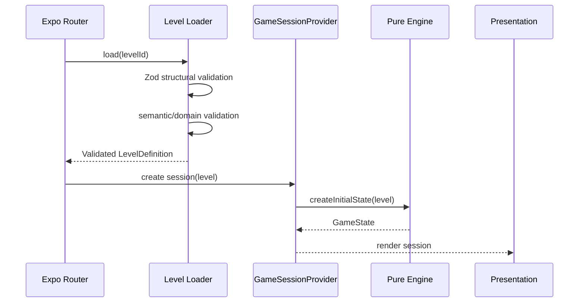
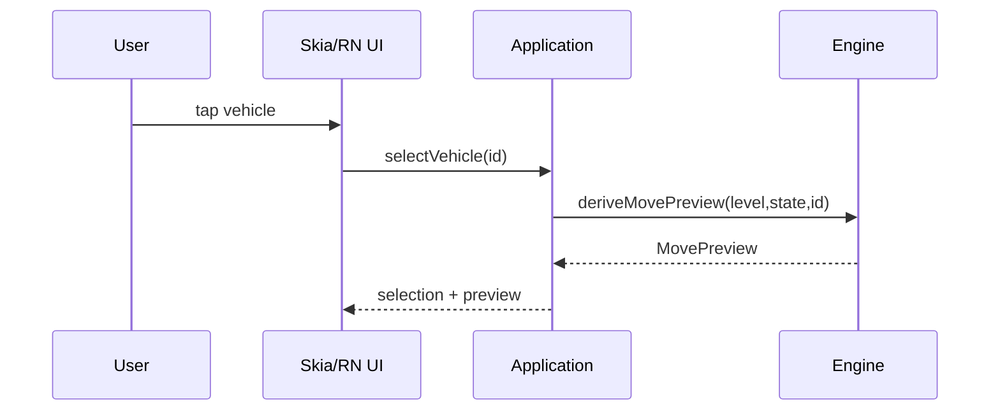
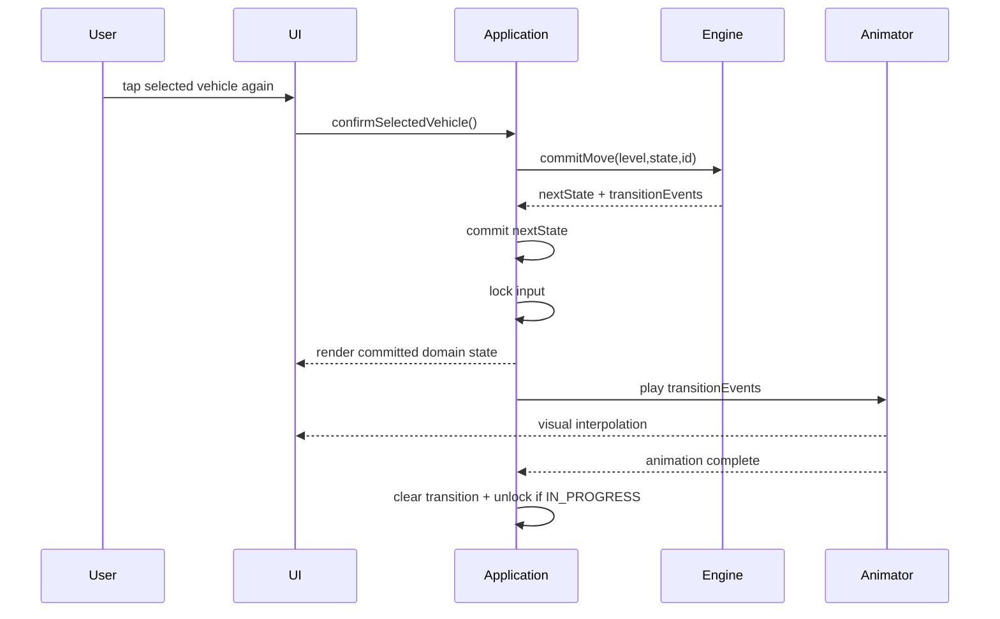
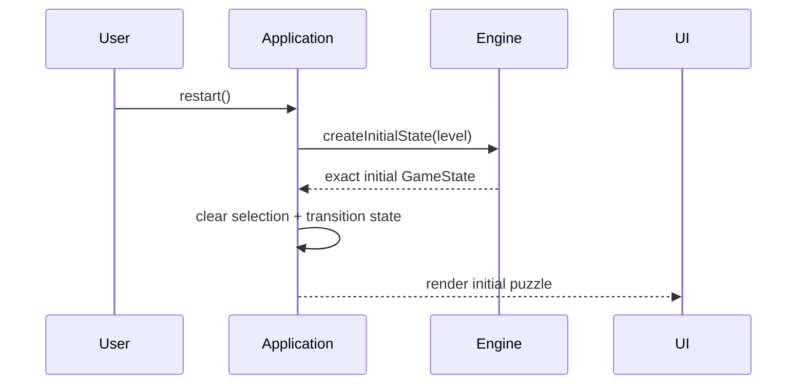

# Phase 3 — Runtime Flow

## 1. Session startup



Invalid levels never create an active game session.

---

## 2. Vehicle selection



GameState is unchanged.

---

## 3. Confirmed valid move



The engine does not wait for animation.

---

## 4. Invalid move

```text
Tap selected vehicle
   │
   ▼
validate / preview says invalid
   │
   ├── GameState unchanged
   ├── turnNumber unchanged
   ├── no junction toggle
   ├── no boarding
   └── presentation shows blocker/reason
```

---

## 5. Automatic resolution

The engine owns the complete automatic phase inside `commitMove`:

```text
board vehicle arrives
    │
    ▼
junction toggles
    │
    ▼
waiting-slot assigned
    │
    ▼
front passenger matching loop
    │
    ├── board
    ├── vehicle becomes full
    └── departure/despawn
    │
    ▼
repeat until fixed point
    │
    ▼
win check
    │
    ▼
legal moves / deadlock check
```

Presentation receives descriptive events after the engine already knows the normalized result.

---

## 6. Restart flow



Restart does not replay history backward.

---

## 7. Animation interruption

If app lifecycle or rendering interrupts an animation:

- authoritative GameState remains the already committed normalized state,
- visual transition may be cancelled,
- presentation re-renders directly from current GameState,
- no engine command is replayed automatically.

This guarantees visual failure cannot duplicate a move.

---

## 8. Input lock

Input is locked while a committed transition is being visualized.

Allowed during input lock:

- application lifecycle handling,
- rendering,
- animation cancellation/recovery.

Not allowed:

- selecting another vehicle,
- confirming another move,
- mutating GameState from presentation.

Restart behavior during an active animation is an Application-layer policy; MVP should cancel the visual transition and reconstruct initial GameState atomically.
